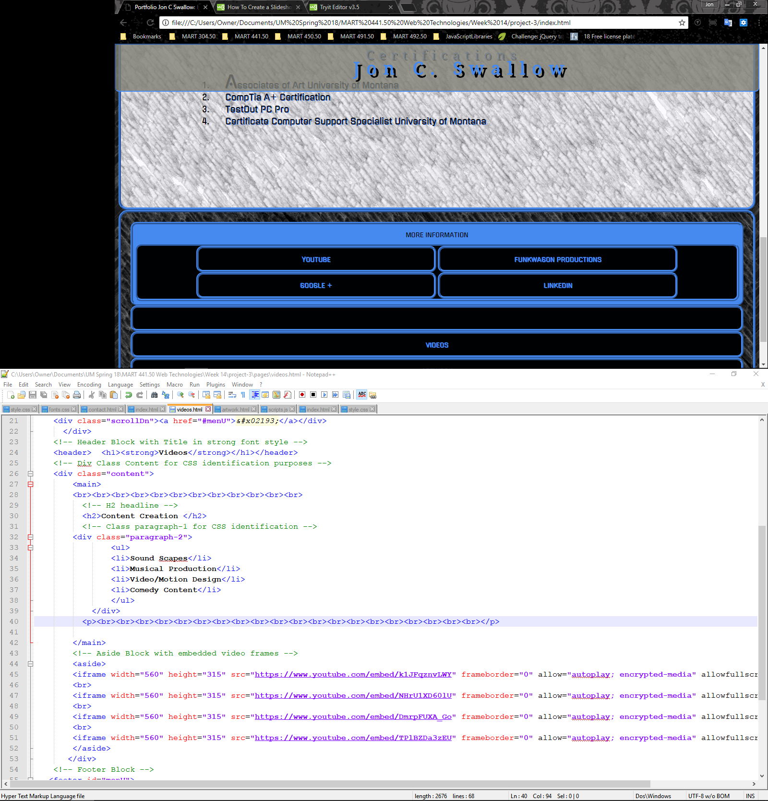
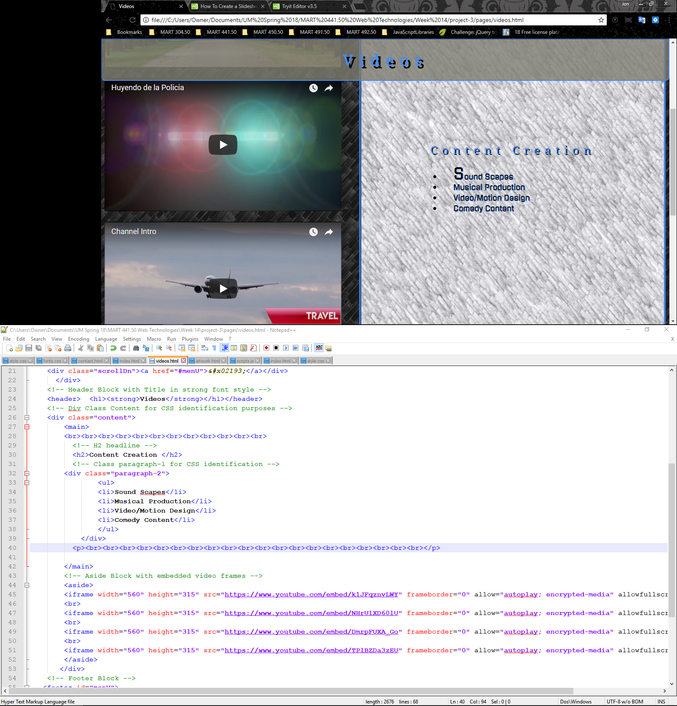

#PERSONALWEBSITE

[Live Site](https://jonswallow.github.io/PersonalWeb/)

[Repository](https://github.com/JonSwallow/441-work/tree/master/HW-10)

## Overview
I used a template of sorts by reworking an old assignment from MART342.50 to suit my immediate needs, adding javaScript and reworking the css.


## Code
```
header {
    background-color: rgba(127,126,115, .80);

    position: fixed;
    width: 100%;
    top: 0px;
    left: 0px;
    right: 0px;
    margin: 0;
    color:#468af0;
    max-height: 100px;
    text-align: center;
    border-style: inset;
    border-color: #468af0;
    border-width: 2px;
    border-radius: 0em 0em .5em .5em / 0em 0em .5em .5em;
}
/* I made a special class just for this bad boy. I used it to position it within the header
unfortunately every time I scooted it over a bit the text went as well. I finally went cheap with the spacers
in the Html. (&nbsp) It sucks but it is what it is. */
.logo {
  min-width: 70px;
  max-width: 70px;
  min-height: 90px;
  max-height: 90px;
  padding-right: 14em;
  /* Here is that float and clear.*/
  float: right;
  clear: both;
  position: relative;
}
/* Since I refused to change the bottom menu for usability I am adding this arrow which links to the footer*/
.container {

margin-top: -2em;
  margin-left: 10em;
   float: left;
    clear: right;
    text-align: center;
   z-index: 1;
   position: relative;
}
.scrollDn {
font-size: 32pt;
color:#468af0 ;
text-shadow: 2px 2px #000103;
 }

.scrollDn:hover {
  color:#030303;
  text-shadow: 2px 2px #468af0;
}

.scrollTxt {
padding-top: 1em;
color: #468af0 ;
text-shadow: 2px 2px #000103;

}
```

## Problems
I had hell with the slideshow at first I slept on it and totally reworked it using the W3 site as a reference.
The Caps lock on during naming it is apparently not possible to change the file extension to lower case and expect GitHub to upload, as 
a result I added a one behind the usual naming convention to fix the break. Live page caps matters in the extension running it from the desktop in the 
browser it does not something to be careful for. 

## Results
##### Example of workflow


##### Another Example of workflow


### Future work
I guess we will see 

### Comunity Spirit
None whatsoever this week

### Conclusions
I felt like I mearely rearranged most of the code this semester not very confident in writing my own but I guess at least I have a start for future projects.
